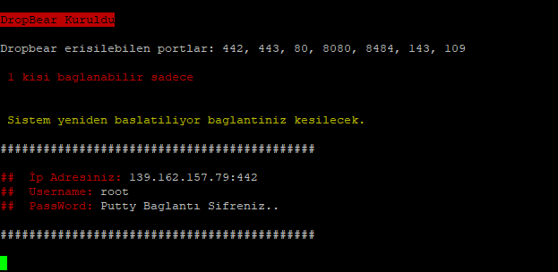
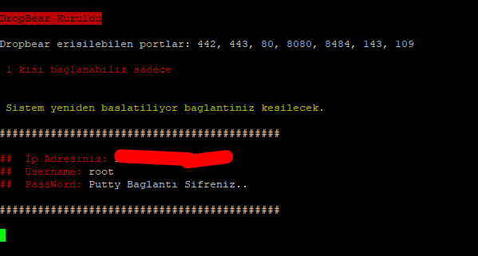

# dropbear-ssh

Merhabalar;

işletim sistemi: debian 8, Debain 9, Ubuntu 16

**Kurulum için gerekli kod:**

`cd /root/ & curl -O https://raw.githubusercontent.com/potaha/dropbear-ssh/main/ssh_install.sh && chmod +x ssh_install.sh && /bin/bash ssh_install.sh`

Konsola yukarıdaki kodu direk yapıştırın ve bitmesini bekleyiniz.

Kurulum Süresi: max 1 Dakika

kurulum bu kadardır

